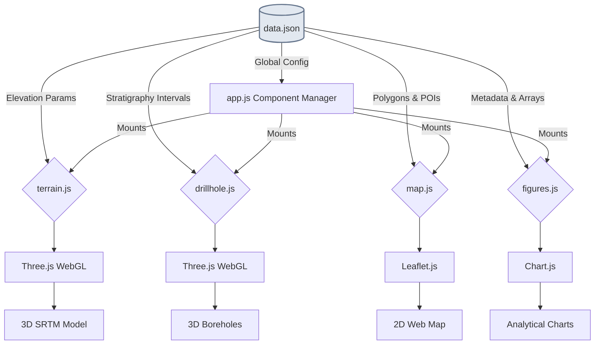

# Title: An Open-Source, Data-Driven Interactive Web Framework for 3D Visualization of Geoheritage Sites: A Case Study of the Grand Canyon

**Journal:** Geoheritage (Springer)
**Author:** Gul Nawaz
**Keywords:** Geoheritage, 3D Geovisualization, Open-Source Software, WebGIS, Stratigraphy, Digital Twin

## Abstract
Effective dissemination and educational utilization of prominent geoheritage sites are often hindered by the steep learning curves and licensing costs inherent to professional Geographic Information Systems (GIS) and 3D modeling software. To bridge this accessibility gap, we present a universal, browser-based, open-source 3D visualization framework. Developed leveraging Three.js and Leaflet.js, the framework completely decouples computational rendering logic from hardcoded geological datasets through a centralized JSON schema (`data.json`). This architecture enables researchers, educators, and park managers to transform structural geological mapping, sequence stratigraphy, and digital elevation models (DEM)—without programming knowledge—into deeply interactive web environments. We demonstrate the framework's robustness by applying it to the iconic stratigraphy and structure of the Grand Canyon, showcasing dynamic 3D SRTM terrain generation, interactive measured stratigraphic boreholes, 2D WebGIS mapping, and analytical figure generation integrated within a unified dashboard. The framework represents a scalable approach to virtual geo-conservation and digital geotourism.

## 1. Introduction
Geological heritage (geoheritage) encompasses significant geological features, landforms, and stratigraphy that offer societal, educational, and scientific value (Reynard and Brilha 2018). As digital technologies evolve, virtual geotourism and educational "digital twins" of geoheritage sites have become a fundamental methodology in geoscience outreach (Cai et al. 2021). However, representing complex 3D geology traditionally relies on proprietary desktop software (e.g., ArcGIS, Petrel) that creates a barrier for the general public and resource-limited academic institutions.
The rise of WebGL and WebGIS affords the capacity to deploy sophisticated 3D geological models directly into modern internet browsers. Despite this, existing academic web viewers often hardcode their data, hindering reusability by other researchers. This paper introduces an entirely data-driven, client-side web framework that facilitates the interactive presentation of any geoheritage site using an extensible JSON data format.

## 2. Methodology and System Architecture
The application is structured as a fully decoupled Single Page Application (SPA), emphasizing high performance, low hosting overhead (static delivery), and universal applicability. The rendering pipeline completely separates site-specific inputs from the visualization engine, as detailed in Figure 1.

**Figure 1.** System Architecture Diagram illustrating the decoupled HTML5/JavaScript initialization. The `data.json` schema drives multiple front-end visualization engines simultaneously without requiring hardcoded parameters.
### 2.1 Decoupled Data Schema (`data.json`)
The core innovation of this framework lies in the strict separation of concerns between the JavaScript rendering modules and the geological dataset. All site-specific parameters—such as bounding coordinates for dynamically streamed Shuttle Radar Topography Mission (SRTM) terrain tiles, stratigraphic column definitions (ages, lithologies, colors), geologic map polygon vertices, and profile-view analytical chart arrays—are encapsulated within a centralized `data.json` file. Consequently, researchers can repurpose the entire interactive application for a new geoheritage site simply by editing the JSON dictionary.

### 2.2 Framework Rendering Modules
The architecture uses modular scripts for distinctive visualization domains:
- **3D Terrain Module (`terrain.js`):** Utilizes `Three.js` to process real-time AWS Terrarium elevation tiles into custom `BufferGeometry`, adapting dynamic hypsometric styling across precise user-defined boundaries.
- **Stratigraphic Borehole Module (`drillhole.js`):** Extrudes cylindrical geometry representing physical drill cores and surface measured sections over depth intervals, binding standard CMYK/RGB geological coloring.
- **Geological Map Module (`map.js`):** Wraps `Leaflet.js` to render vector polygons (formations), polylines (structural faults), and interactive CircleMarkers (fossil localities, sample loci), layered over interchangeable basemaps.
- **Presentation Module (`figures.js`):** Orchestrates `Chart.js` rendering to display statistically derived formation distribution tables, age-correlation log graphs, and geomorphological cross-sections.

## 3. Case Study: Grand Canyon, USA
To validate the framework, geological and geospatial data from the Grand Canyon, Arizona—a premier global geoheritage site—was formatted into the schema.
The prototype effectively aggregates data digitized from Billingsley et al. (2000) (USGS Map I-2688) and Beus & Morales (2003) (Grand Canyon Geology). The viewer accurately renders the sweeping topographic plunge from the Kaibab Limestone plateau to the Vishnu Basement Rocks of the Inner Gorge. In addition to topographic accuracy, six specific stratigraphic sections were visualized interactively as 3D drill logs. The ability to switch fluidly between a 3D topographic view and an interactive structural field map provides an unprecedented unified spatial context for undergraduate educational workflows.

## 4. Discussion
The deployment of this framework highlights three foundational benefits for the geoheritage community:
1. **Accessibility:** As an HTML5/JavaScript application, it requires zero installation and can be served from inexpensive static hosting environments (e.g., GitHub Pages) to standard mobile and desktop browsers.
2. **Reproducibility:** By storing the spatial arrays, stratigraphic attributes, and metadata in a single JSON structure, the framework enforces a machine-readable, interchangeable data standard.
3. **Public Engagement:** The aesthetic quality achieved by dynamic 3D lighting, shadowing, and interactive legends enhances the communicative power of raw geological data, turning static publications into exploratory exhibits.

## 5. Conclusion
Digital conservation of geoheritage depends heavily on open-access, intuitive dissemination paradigms. The Interactive 3D Geological Framework is a versatile foundation that allows geoscientists to securely, rapidly, and compellingly "publish" their local geological mapping and modeling as a unified WebGL environment. It stands as a tool specifically designed to amplify open-science initiatives in geology.

## 6. Software Availability
*The source code, complete with the Grand Canyon sample dataset, is provided under the MIT License and hosted openly.*

## References
1. Beus, S. S., & Morales, M. (Eds.). (2003). *Grand Canyon Geology* (2nd ed.). Oxford University Press.
2. Billingsley, G. H. (2000). Geologic Map of the Grand Canyon 30' by 60' Quadrangle, Coconino and Mohave Counties, Northwestern Arizona. *U.S. Geological Survey Geologic Investigations Series I-2688*.
3. Cai, Y., et al. (2021). Web-based 3D visualization of large-scale geological models. *Computers & Geosciences*.
4. Reynard, E., & Brilha, J. (Eds.). (2018). *Geoheritage: Assessment, Protection, and Management*. Elsevier.
